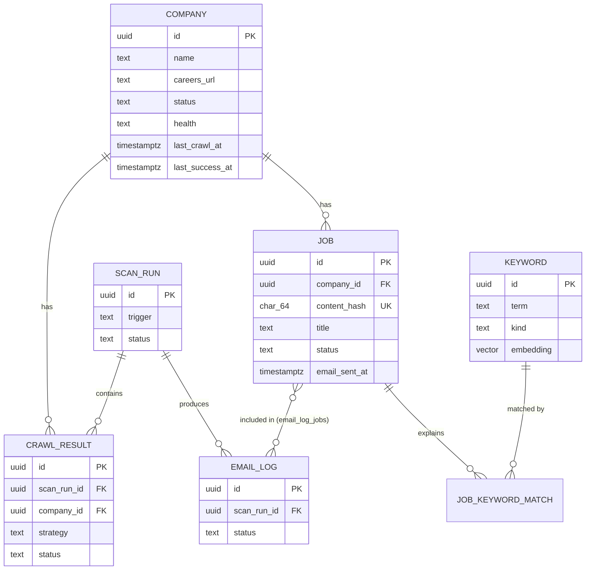

# LoopJob — Database Schema

**Version:** 1.0 · **Status:** Draft, pending approval
**Engine:** PostgreSQL 16 · **ORM:** SQLAlchemy 2.x (declarative, async) · **Migrations:** Alembic
**Cache/broker (not shown here):** Redis — Celery broker, per-domain rate-limit buckets, embedding cache, scan locks.

---

## 1. Entity-relationship overview

## 2. Tables

### 2.1 `companies`

| Column | Type | Constraints | Notes |
|--------|------|-------------|-------|
| `id` | `uuid` | PK, default `gen_random_uuid()` | |
| `name` | `text` | NOT NULL, UNIQUE (case-insensitive index) | "Google" |
| `careers_url` | `text` | NULL | Verified careers page; NULL until discovered |
| `careers_url_verified_at` | `timestamptz` | NULL | Last successful verification |
| `status` | `text` | NOT NULL, default `'active'`, CHECK in (`active`,`paused`,`deleted`) | Soft delete via `deleted` |
| `health` | `text` | NOT NULL, default `'unknown'`, CHECK in (`unknown`,`healthy`,`degraded`,`failing`) | Derived, denormalized for fast listing |
| `consecutive_failures` | `int` | NOT NULL, default 0 | Drives `health` |
| `preferred_strategy` | `text` | NULL | Last strategy that succeeded; tried first next scan |
| `last_crawl_at` | `timestamptz` | NULL | Last attempt |
| `last_success_at` | `timestamptz` | NULL | Last successful crawl |
| `notes` | `text` | NULL | Free-form user notes |
| `created_at` / `updated_at` | `timestamptz` | NOT NULL, default now() | `updated_at` via trigger/ORM |

Indexes: `UNIQUE (lower(name))`; `(status)` partial where `status='active'`.

### 2.2 `keywords`

| Column | Type | Constraints | Notes |
|--------|------|-------------|-------|
| `id` | `uuid` | PK | |
| `term` | `text` | NOT NULL | "Software Engineer" |
| `kind` | `text` | NOT NULL, CHECK in (`include`,`requirement`,`exclude`) | The three filter classes |
| `embedding` | `vector(1536)` | NULL (pgvector) | Only for `include`; NULL for others. Dim 1536 = text-embedding-3-small; local model vectors padded/stored in `embedding_local vector(384)` alternative column |
| `embedding_model` | `text` | NULL | Which model produced the stored vector (cache invalidation) |
| `enabled` | `boolean` | NOT NULL, default true | Toggle without delete |
| `created_at` / `updated_at` | `timestamptz` | NOT NULL | |

Indexes: `UNIQUE (lower(term), kind)`.

> **pgvector note:** pgvector is used as a durable embedding cache and enables future "similar jobs" queries. If pgvector is unavailable on the host, fallback is a `bytea`/JSON column — the matcher only needs to load vectors, not query by distance, in v1.

### 2.3 `jobs`

| Column | Type | Constraints | Notes |
|--------|------|-------------|-------|
| `id` | `uuid` | PK | |
| `company_id` | `uuid` | FK → companies, NOT NULL, ON DELETE RESTRICT | |
| `content_hash` | `char(64)` | NOT NULL, **UNIQUE** | SHA-256 of normalized identity — *the* dedup guarantee |
| `external_id` | `text` | NULL | Portal's own job ID when available |
| `title` | `text` | NOT NULL | |
| `location` | `text` | NULL | Normalized display string |
| `apply_url` | `text` | NOT NULL | Direct link |
| `description_snippet` | `text` | NULL | First ~1000 chars for matching/preview |
| `posted_at` | `date` | NULL | From portal when available |
| `first_seen_at` | `timestamptz` | NOT NULL, default now() | |
| `last_seen_at` | `timestamptz` | NOT NULL, default now() | Touched on re-crawl |
| `status` | `text` | NOT NULL, CHECK in (`new`,`matched`,`excluded`,`unmatched`) | Matching outcome |
| `match_score` | `real` | NULL | Final score incl. boosts |
| `match_reasons` | `jsonb` | NOT NULL, default `'[]'` | `[{"term":"Internship","kind":"include","similarity":0.91}, {"term":"Batch 2027","kind":"requirement"}]` |
| `email_sent_at` | `timestamptz` | NULL | Set exactly once — second dedup guard |
| `user_state` | `text` | NOT NULL, default `'none'`, CHECK in (`none`,`bookmarked`,`applied`) | User tracking |
| `user_state_at` | `timestamptz` | NULL | When marked |
| `source_strategy` | `text` | NOT NULL | Which strategy found it |
| `embedding` | `vector(1536)` | NULL | Cached job embedding |
| `created_at` / `updated_at` | `timestamptz` | NOT NULL | |

Indexes: `UNIQUE (content_hash)`; `(company_id, first_seen_at DESC)`; `(status)`; `(user_state)` partial where ≠ `'none'`; `(posted_at DESC)`; partial index `(status) WHERE status='matched' AND email_sent_at IS NULL` (the email queue query).

### 2.4 `scan_runs`

| Column | Type | Constraints | Notes |
|--------|------|-------------|-------|
| `id` | `uuid` | PK | |
| `trigger` | `text` | NOT NULL, CHECK in (`scheduled`,`manual`,`manual_company`) | |
| `status` | `text` | NOT NULL, CHECK in (`running`,`completed`,`completed_with_errors`,`failed`) | |
| `started_at` | `timestamptz` | NOT NULL | |
| `finished_at` | `timestamptz` | NULL | |
| `companies_total` / `companies_ok` / `companies_failed` | `int` | NOT NULL, default 0 | |
| `jobs_found` / `jobs_new` / `jobs_matched` | `int` | NOT NULL, default 0 | Denormalized totals |
| `error` | `text` | NULL | Run-level failure cause |

Index: `(started_at DESC)`.

### 2.5 `crawl_results` (per company, per run)

| Column | Type | Constraints | Notes |
|--------|------|-------------|-------|
| `id` | `uuid` | PK | |
| `scan_run_id` | `uuid` | FK → scan_runs, NOT NULL, ON DELETE CASCADE | |
| `company_id` | `uuid` | FK → companies, NOT NULL | |
| `strategy` | `text` | NOT NULL | `careers_page` / `job_api` / `search_engine` / `fallback_search` / `llm_extraction` |
| `strategies_attempted` | `jsonb` | NOT NULL, default `'[]'` | Ordered attempts with failure causes |
| `status` | `text` | NOT NULL, CHECK in (`success`,`empty`,`failed`) | `empty` = crawl OK, zero jobs parsed |
| `jobs_found` / `jobs_new` / `jobs_matched` | `int` | NOT NULL, default 0 | |
| `duration_ms` | `int` | NULL | |
| `error` | `text` | NULL | |
| `created_at` | `timestamptz` | NOT NULL | |

Indexes: `(scan_run_id)`; `(company_id, created_at DESC)`.

### 2.6 `email_logs`

| Column | Type | Constraints | Notes |
|--------|------|-------------|-------|
| `id` | `uuid` | PK | |
| `scan_run_id` | `uuid` | FK → scan_runs, NULL | NULL for future manual sends |
| `recipient` | `text` | NOT NULL | |
| `subject` | `text` | NOT NULL | |
| `job_count` | `int` | NOT NULL | |
| `status` | `text` | NOT NULL, CHECK in (`sent`,`failed`) | |
| `provider_message_id` | `text` | NULL | Resend ID |
| `error` | `text` | NULL | |
| `sent_at` | `timestamptz` | NOT NULL, default now() | |

### 2.7 `email_log_jobs` (join)

| Column | Type | Constraints |
|--------|------|-------------|
| `email_log_id` | `uuid` | FK → email_logs, PK part |
| `job_id` | `uuid` | FK → jobs, PK part |

### 2.8 `schedules`

| Column | Type | Constraints | Notes |
|--------|------|-------------|-------|
| `id` | `uuid` | PK | |
| `hour` | `smallint` | NOT NULL, CHECK 0–23 | |
| `minute` | `smallint` | NOT NULL, default 0, CHECK 0–59 | |
| `enabled` | `boolean` | NOT NULL, default true | |
| `created_at` | `timestamptz` | NOT NULL | |

Unique: `(hour, minute)`. Timezone lives in `settings` (single value, applies to all).

### 2.9 `settings` (single-row app config)

| Column | Type | Notes |
|--------|------|-------|
| `id` | `smallint` PK, CHECK (id = 1) | Enforced single row |
| `timezone` | `text`, default `'Asia/Kolkata'` | |
| `notification_email` | `text` | Recipient |
| `email_enabled` | `boolean`, default true | |
| `match_threshold` | `real`, default 0.55 | |
| `requirement_boost` | `real`, default 0.05 | Per requirement hit, capped |
| `scan_concurrency` | `smallint`, default 4 | Parallel companies |
| `embedding_provider` | `text`, default `'openai'` | `openai` / `local` |
| `updated_at` | `timestamptz` | |

> Secrets (OpenAI key, Resend key, DB URL) are **never** stored here — env only (NFR-6).

## 3. Dedup & idempotency logic (schema-level guarantees)

1. **Job identity:** `content_hash = sha256(company_id + "|" + norm(title) + "|" + norm(location) + "|" + canonical_path(apply_url))`. `norm` = lowercase, collapse whitespace, strip punctuation. `canonical_path` strips query params/tracking.
2. **Insert path:** `INSERT ... ON CONFLICT (content_hash) DO UPDATE SET last_seen_at = now()` — new rows come back flagged; only they proceed to matching.
3. **Email guarantee:** digest query = `status='matched' AND email_sent_at IS NULL`; `email_sent_at` set in the same transaction as `email_logs` insert after provider acceptance. Unique hash + this flag ⇒ a job can never be emailed twice.

## 4. Migration & seed plan

- Alembic migration `0001_initial` creates all tables + indexes (+ `CREATE EXTENSION IF NOT EXISTS vector`, guarded).
- Seed script (`make seed`): 14 seed companies (Google, Microsoft, Amazon, Adobe, Salesforce, Atlassian, Oracle, Cisco, Nvidia, Visa, Uber, Rubrik, LinkedIn, Intuit), default keyword sets from the brief, default schedule (08:00/14:00/20:00), settings row.
