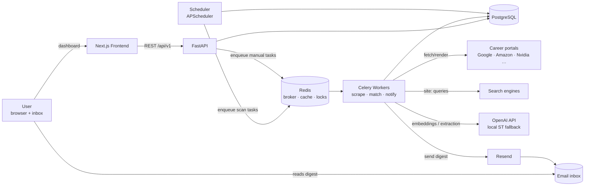
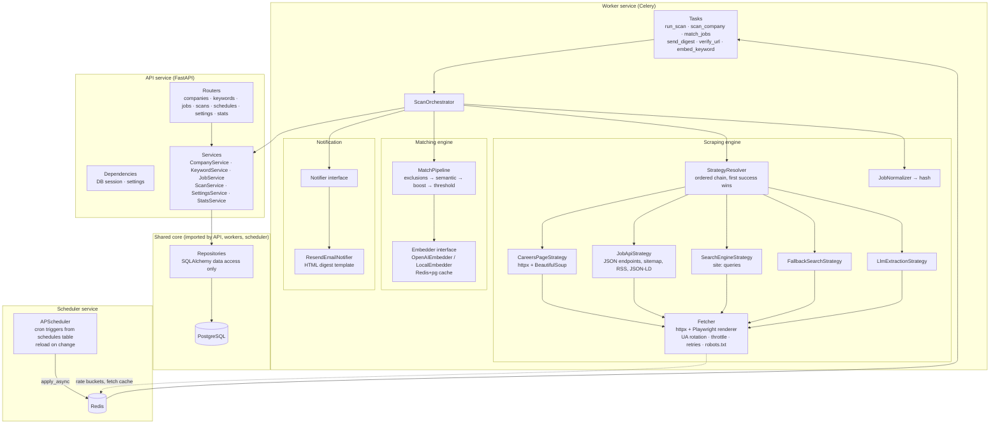
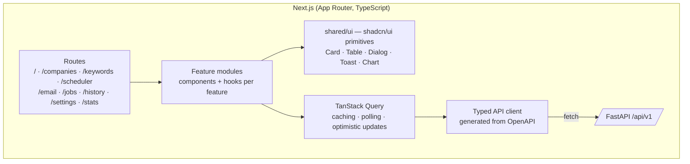

# LoopJob — System Architecture & Component Diagrams

**Version:** 1.0 · **Status:** Draft, pending approval

---

## 1. Architecture style

**Modular monolith + worker fleet.** One FastAPI app (API), one Celery worker pool (scraping/matching/email), one scheduler process (APScheduler → Celery dispatch), one Next.js frontend. PostgreSQL is the source of truth; Redis is broker + cache + locks.

Why not microservices: single user, single team, tight iteration loop. Why not a single process: scraping (Playwright) is heavy, bursty, and crash-prone — it must be isolated from the API and restartable independently. Feature-first module boundaries keep a later split possible.

## 2. System context



## 3. Backend component diagram



### Component responsibilities

| Component | Responsibility | Key rule |
|-----------|----------------|----------|
| **Routers** | HTTP concerns only: validation (Pydantic), status codes | No business logic |
| **Services** | Business logic, transactions, orchestration of repos | No SQL, no HTTP |
| **Repositories** | All DB access (SQLAlchemy) | No business decisions |
| **ScanOrchestrator** | Per-run flow: fan out companies → collect → match → dedup-insert → digest | Idempotent; company failures isolated |
| **StrategyResolver** | Picks/orders strategies (company's `preferred_strategy` first), executes chain | Strategies are plugins implementing `ScrapeStrategy` protocol |
| **Fetcher** | The only component that touches the network for scraping | Enforces politeness centrally: per-domain throttle (Redis token bucket), UA rotation, backoff, robots.txt |
| **JobNormalizer** | Raw extraction → canonical `RawJob` → `content_hash` | Pure function, heavily unit-tested |
| **MatchPipeline** | exclusion rules → embedding similarity → requirement boost → threshold → reasons | Pure given embeddings; deterministic |
| **Embedder** | `embed(texts) -> vectors` behind an interface; caching decorator | OpenAI primary, sentence-transformers fallback, cache-first |
| **Notifier** | `notify(digest) -> result` interface | Resend impl in v1; Telegram/Slack/Discord later |
| **APScheduler service** | Reads `schedules` table, registers cron triggers, enqueues `run_scan` | Stateless besides DB; safe to restart |

## 4. Frontend architecture



- **State:** server state via TanStack Query (no Redux); minimal client state via React state/context.
- **Styling:** TailwindCSS + shadcn/ui; design tokens per [09-ui-design-system.md](09-ui-design-system.md).
- **Type safety:** `openapi-typescript` generates request/response types from the backend schema in CI.

## 5. Folder structure (feature-first)

```
loopjob/
├── docs/                          # These documents
├── PROGRESS.md                    # Live implementation checklist
├── docker-compose.yml             # postgres, redis, api, worker, scheduler, frontend
├── Makefile                       # dev, test, seed, migrate, lint
├── backend/
│   ├── pyproject.toml             # uv/poetry; ruff, mypy, pytest config
│   ├── alembic/                   # migrations
│   └── app/
│       ├── config.py              # pydantic-settings (env-typed)
│       ├── main.py                # FastAPI app factory
│       ├── api/                   # routers only
│       │   ├── companies.py … stats.py
│       │   └── deps.py
│       ├── features/
│       │   ├── companies/         # service.py, repository.py, models.py, schemas.py
│       │   ├── keywords/
│       │   ├── jobs/
│       │   ├── scans/             # orchestrator.py, service.py, …
│       │   ├── scheduling/
│       │   ├── settings/
│       │   └── stats/
│       ├── scraping/
│       │   ├── strategies/        # base.py + one file per strategy
│       │   ├── fetcher.py         # httpx + playwright, politeness
│       │   ├── extractors/        # html tables, json-ld, rss, sitemap
│       │   └── normalizer.py
│       ├── matching/
│       │   ├── pipeline.py
│       │   ├── embedders/         # base.py, openai.py, local.py, cache.py
│       │   └── rules.py           # exclusions, requirement matching
│       ├── notifications/
│       │   ├── base.py            # Notifier protocol
│       │   ├── resend_email.py
│       │   └── templates/         # digest.html (jinja2) + plaintext
│       ├── workers/
│       │   ├── celery_app.py
│       │   └── tasks.py
│       ├── scheduler/
│       │   └── main.py            # APScheduler entrypoint
│       ├── db/                    # engine, session, base model
│       └── shared/                # logging, errors, redis, rate_limit, hashing
│   └── tests/
│       ├── unit/  integration/  fixtures/   # saved portal HTML/JSON
├── frontend/
│   ├── package.json
│   └── src/
│       ├── app/                   # Next.js routes (9 pages)
│       ├── features/              # companies/, jobs/, … (components + hooks)
│       ├── shared/                # ui/ (shadcn), lib/, api/ (generated client)
│       └── styles/
└── .env.example
```

## 6. Key design decisions (ADR summary)

| # | Decision | Rationale | Alternative rejected |
|---|----------|-----------|----------------------|
| D1 | Modular monolith, separate worker/scheduler processes | Isolation of crashy scraping from API; simple ops | Microservices (overkill), single process (fragile) |
| D2 | Celery + Redis for background work | Retries, acks-late, concurrency control, mature | RQ/Arq (fewer features), in-process asyncio tasks (lost on crash) |
| D3 | APScheduler (dedicated process) feeding Celery | DB-driven dynamic schedules without restart; Celery Beat's schedule is config-static | Celery Beat (poor dynamic-schedule story), system cron (no UI editability) |
| D4 | Strategy pattern with per-company `preferred_strategy` memory | Adaptivity requirement; learns the working path per company | One fixed scraper per company (brittle, high maintenance) |
| D5 | Embeddings for matching, exclusions as hard rules | Semantic recall + guaranteed precision on unwanted roles; cheap | Pure LLM classification per job (cost/latency), pure keywords (fails brief's requirement) |
| D6 | OpenAI embeddings with local sentence-transformers fallback | Quality first, $0 degraded mode, offline dev | Local-only (weaker), OpenAI-only (hard dependency) |
| D7 | Dedup at DB level (unique hash) not app level | Survives races, restarts, code bugs | In-memory seen-set (lost on restart) |
| D8 | Polling over WebSockets for scan progress | Single-user scale; removes a stateful failure mode | SSE/WS (deferred, additive later) |
| D9 | Playwright only as escalation (httpx first) | 10× cheaper/faster when static works | Playwright-always (slow, heavy) |
