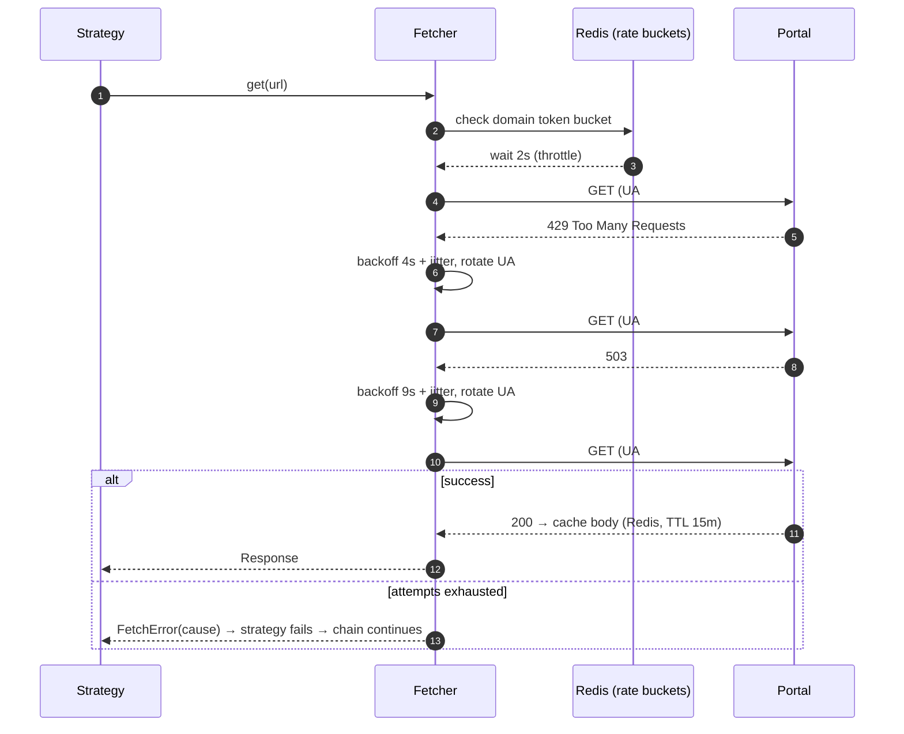
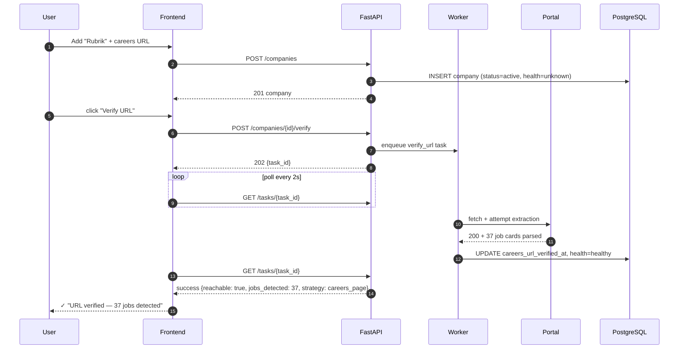
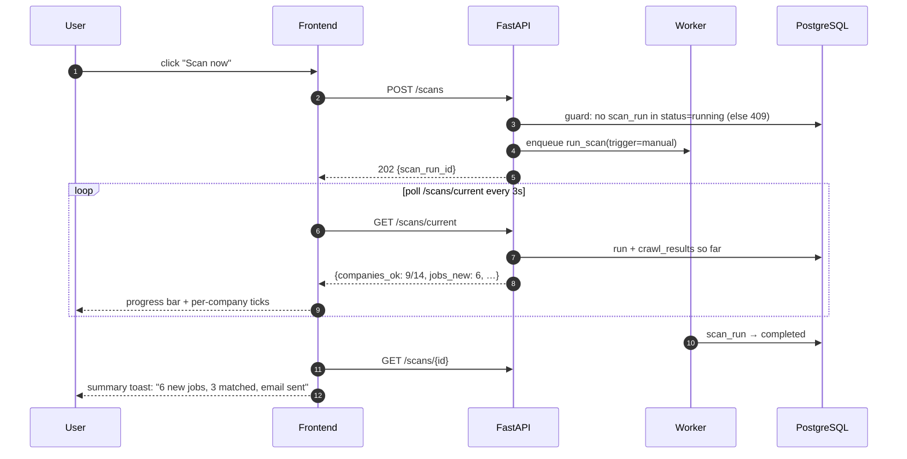
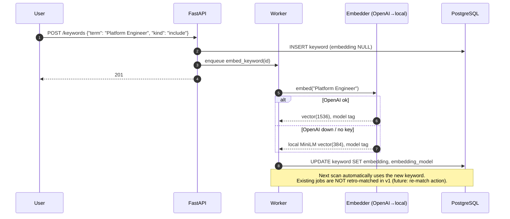

# LoopJob — Sequence Diagrams

**Version:** 1.0 · **Status:** Draft, pending approval

---

## 1. Scheduled scan (the core loop)

```mermaid
sequenceDiagram
    autonumber
    participant APS as Scheduler (APScheduler)
    participant R as Redis (broker/locks)
    participant W as Celery Worker
    participant O as ScanOrchestrator
    participant P as Career Portal
    participant M as MatchPipeline
    participant DB as PostgreSQL
    participant RS as Resend

    APS->>R: enqueue run_scan(trigger="scheduled")
    R->>W: deliver run_scan
    W->>DB: INSERT scan_run(status=running)
    W->>DB: SELECT active companies
    loop per company (concurrency = 4, isolated failures)
        W->>R: acquire lock scan:{company_id}
        W->>O: scan_company(company)
        O->>O: resolve strategy chain (preferred first)
        O->>P: fetch (throttled, UA-rotated, retries)
        P-->>O: HTML / JSON
        O->>O: extract + normalize → RawJob[] + content hashes
        O->>DB: INSERT jobs ON CONFLICT(hash) DO UPDATE last_seen_at
        DB-->>O: newly inserted rows only
        O->>M: match(new jobs, keywords)
        M->>M: hard exclusions → embed → similarity → boost → threshold
        M->>DB: UPDATE jobs SET status, score, reasons
        O->>DB: INSERT crawl_result (strategy, counts, duration)
        O->>DB: UPDATE company health, last_success_at, preferred_strategy
        W->>R: release lock
    end
    W->>DB: SELECT jobs WHERE status=matched AND email_sent_at IS NULL
    alt new matches exist
        W->>RS: send digest (HTML, grouped by company, reasons)
        RS-->>W: accepted (message_id)
        W->>DB: INSERT email_log + email_log_jobs; SET email_sent_at (same txn)
    else none
        W->>W: skip email
    end
    W->>DB: UPDATE scan_run (status=completed, totals)
```

## 2. Strategy chain with fallback (one company)

```mermaid
sequenceDiagram
    autonumber
    participant O as ScanOrchestrator
    participant F as Fetcher
    participant P as Portal
    participant SE as Search Engine
    participant LLM as LLM

    O->>F: CareersPageStrategy: GET careers_url
    F->>P: httpx GET (UA #1)
    P-->>F: 200, but JS-shell HTML (no jobs parseable)
    F->>P: Playwright render
    P-->>F: rendered DOM
    alt jobs extracted
        F-->>O: RawJob[] ✓ (record strategy=careers_page)
    else extraction empty
        O->>F: JobApiStrategy: probe JSON endpoints / sitemap / RSS / JSON-LD
        P-->>F: 404 on probes
        O->>SE: SearchEngineStrategy: site:careers.x.com intern 2027
        SE-->>O: result URLs
        O->>F: fetch each result page
        alt jobs extracted
            F-->>O: RawJob[] ✓ (strategy=search_engine)
        else still nothing
            O->>LLM: LlmExtractionStrategy: raw text → structured JobPosting[]
            LLM-->>O: JSON jobs (validated by Pydantic) ✓ or final failure
        end
    end
    O->>O: record strategies_attempted + failure causes in crawl_result
    Note over O: On total failure: consecutive_failures += 1<br/>health → degraded/failing; surfaced on dashboard
```

## 3. Retry / block handling inside the Fetcher



## 4. User adds a company & verifies URL



## 5. Manual "Scan now" with live progress



## 6. Keyword change → re-embedding


