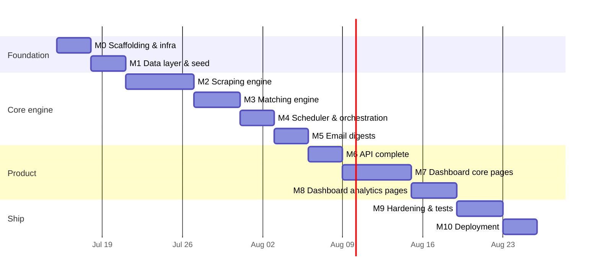

# LoopJob — Development Roadmap & Sprint Plan

**Version:** 1.0 · **Status:** Draft, pending approval

Principle from the brief: **one feature at a time, fully functional before moving on.** Each milestone ends in a runnable, demonstrable state. A live checklist is maintained in `PROGRESS.md`.

---

## Phase overview

~6 weeks part-time. Milestones are strictly ordered; each has an explicit **demo** and **exit criteria**.

---

## Milestones

### M0 — Scaffolding & infrastructure (3d)
Monorepo layout per architecture doc · `docker-compose.yml` (postgres, redis, api, worker, scheduler, frontend) · FastAPI skeleton with `/health`, typed settings, structured logging · Next.js skeleton with shell/sidebar/theme · Makefile (dev/test/lint/migrate/seed) · ruff + mypy + eslint + prettier + pre-commit · CI (GitHub Actions: lint, typecheck, test).
**Demo:** `make dev` boots the whole stack; dashboard shell renders; `/health/deep` all green.
**Exit:** one-command startup on a clean machine.

### M1 — Data layer & seed (3d)
All SQLAlchemy models + Alembic `0001_initial` (schema doc §2) · repositories with unit tests · seed script: 14 companies, brief's keyword sets, 8/14/20h schedule, settings row · hash/normalization utilities (pure, fully tested).
**Demo:** `make seed` then `psql` shows seeded world; hash tests prove dedup identity rules.
**Exit:** schema matches doc; ≥90% coverage on normalizer/hash.

### M2 — Scraping engine (6d) — *highest-risk milestone, done early*
Fetcher (httpx, UA rotation, per-domain Redis throttle, backoff retries, robots.txt, fetch cache) · Playwright renderer escalation · extractors: HTML heuristics, JSON-LD JobPosting, sitemap, RSS, generic JSON API prober · strategies 1–4 wired into StrategyResolver chain with per-company preferred-strategy memory · LLM extraction strategy (5) behind interface, stub acceptable until M3 · fixture suite: saved real HTML/JSON from ≥6 seed-company portals.
**Demo:** CLI `python -m app.scraping.cli scan-company Google` prints normalized jobs + strategy used, for ≥10 of 14 seed companies.
**Exit:** strategy chain, politeness, and normalization all covered by integration tests on fixtures (no live network in CI).

### M3 — Matching engine (4d)
Embedder interface: OpenAI + local sentence-transformers + Redis/pg cache · hard-exclusion rules ("Senior", "5+ years" regex family) · requirement matcher (literal+fuzzy) · MatchPipeline with threshold + boost → status/score/reasons · golden-set test: ~60 hand-labeled title/keyword pairs incl. the brief's examples ("SDE Intern" ↔ "Software Engineer Internship", "University Hiring" ↔ "Campus Hiring").
**Demo:** CLI matches fixture jobs; golden-set precision/recall report printed in CI.
**Exit:** golden set ≥ 90% agreement; local fallback verified with OpenAI key removed.

### M4 — Scheduler & orchestration (3d)
Celery app + tasks (`run_scan`, `scan_company`, `verify_url`, `embed_keyword`) · ScanOrchestrator gluing M2+M3: fan-out with concurrency limit, per-company isolation, Redis locks, `ON CONFLICT` dedup insert, crawl_results + health updates, scan_run accounting · APScheduler service reading `schedules` table, live reload on change.
**Demo:** end-to-end scheduled scan at a test time populates DB; kill a worker mid-run → run completes with errors recorded, no duplicates on rerun.
**Exit:** idempotency proven (run twice → zero new rows); a company failure never aborts the run.

### M5 — Email digests (3d)
Jinja2 responsive HTML digest + plaintext (design doc §9) · ResendEmailNotifier behind Notifier interface with retries · digest assembly query (`matched AND email_sent_at IS NULL`), transactional `email_sent_at` + email_log write · test-email endpoint.
**Demo:** real digest lands in prince908ayush@gmail.com inbox with reasons + working links; second scan sends nothing.
**Exit:** zero-duplicate guarantee tested at DB level; renders in Gmail mobile + desktop.

### M5D — Global discovery (4d) — *scope addition, see [15-global-discovery.md](15-global-discovery.md)*
`DiscoverySource` interface · JSearch/Adzuna aggregator source · ATS board-sweep source (Greenhouse/Lever) · `discovery_queries` model + API · pipeline integration (shared normalize→dedup→match→digest).
**Demo:** saved query "Software Engineer Intern · India" returns matched jobs from non-tracked companies, deduped and emailed.
**Exit:** discovery jobs flow through the same idempotent pipeline; per-query caps enforced.

### M6 — API complete (3d)
All endpoints from the API spec · error envelope + handlers · pagination/filtering on `/jobs` · `/stats/*` queries · OpenAPI polish → TypeScript client generation in CI.
**Demo:** full flows drivable from `/docs` swagger UI.
**Exit:** API integration tests green; generated TS types compile in frontend.

### M7 — Dashboard core pages (6d)
Home (stat cards, recent matches, attention panel) · Companies (table, add/verify/pause/delete, detail drawer) · Keywords (three-column board) · Jobs (filters, search, pagination, apply/applied/bookmark) · Scheduler page · Email settings + test send · Settings page · global Scan-now with live progress polling.
**Demo:** every P0 user story executable end-to-end through the UI.
**Exit:** no direct-API-only operations remain for P0 flows; mobile layout usable.

### M8 — Dashboard analytics (4d)
History page with run drill-down · Statistics page (timeseries, per-company yield, funnel, success rate) · empty states everywhere · toasts/skeletons polish pass.
**Exit:** P1 stories US-4.3, US-6.4, US-6.5 done.

### M9 — Hardening & tests (4d)
Coverage push to targets (≥80% services/repos) · e2e smoke (Playwright test: seed → scan → job appears → mark applied) · failure-mode drills: Redis down, OpenAI down, portal blocking, worker OOM · log/trace audit (correlation IDs end-to-end) · payload-retention pruning job · load sanity (100 companies synthetic).
**Exit:** failure drills all degrade gracefully per NFRs; docs updated where behavior diverged.

### M10 — Deployment (3d)
Production Dockerfiles (multi-stage; Playwright image for worker) · Railway (primary) config + managed Postgres/Redis · env/secret setup, `.env.example` finalized · deploy → run the **7-day soak**: 3 scans/day, zero manual intervention (release criterion G4) · runbook: recover worker, rotate keys, add a company, fix a broken scraper.
**Exit:** production URL live behind basic auth; soak underway; runbook committed.

---

## Sprint plan (2-week sprints)

| Sprint | Milestones | Sprint goal (demo) |
|--------|-----------|--------------------|
| **S1** (Jul 15 – Jul 28) | M0, M1, M2 | "The scraper works": CLI scans ≥10 seed companies via adaptive strategies into a seeded DB. |
| **S2** (Jul 29 – Aug 11) | M3, M4, M5 | "The loop is closed": scheduled scan → semantic match → digest email, zero duplicates. |
| **S3** (Aug 12 – Aug 25) | M6, M7 | "The product exists": full dashboard drives every P0 story. |
| **S4** (Aug 26 – Sep 8) | M8, M9, M10 | "It ships": analytics, hardening, deployed + soak started. |

Sprint rituals (solo-adapted): sprint-start scope check (30 min), mid-sprint risk review (are portals cooperating?), sprint-end demo recorded in `PROGRESS.md` with a screenshot/GIF.

## Definition of Done (every feature)

- [ ] Typed (mypy/tsc strict, clean) · [ ] Tested (unit + integration where applicable) · [ ] Logged (structured, correlation ID) · [ ] Error-handled (no bare excepts; user-facing errors surfaced in UI) · [ ] Configurable (tunables in settings, not constants) · [ ] Documented (README/module docstring updated) · [ ] Demoed (works via UI or CLI end-to-end) · [ ] `PROGRESS.md` checked off
